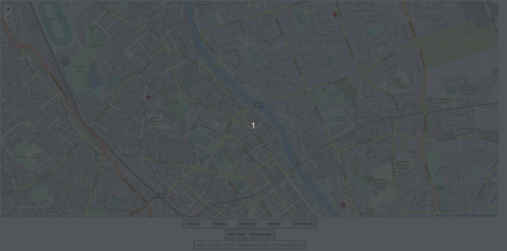
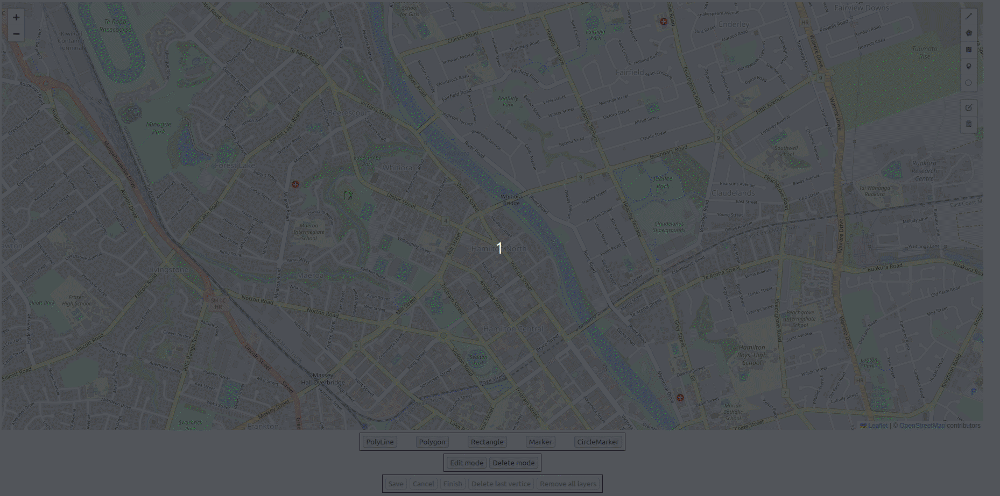

# Leaflet-Euclides

This fork of Leaflet.draw is a **work in progress**.

## Features

- (**OPTIONAL**) External Buttons to use with Leaflet Draw
- Code updated to ES5 javascript
- Code compatible with leaflet 1.0.0+

## Install

```
npm install leaflet-euclides
```

## Preview

### With custom buttons



### Without custom buttons



----

Adds support for drawing and editing vectors and markers on [Leaflet maps](https://github.com/Leaflet/Leaflet).

Supports [Leaflet](https://github.com/Leaflet/Leaflet/releases) 1.0.0+ branches.

Please check out our [Api Documentation](https://leaflet.github.io/Leaflet.draw/docs/leaflet-draw-latest.html)

## In this readme

- [Customizing Language](#customizing-language-and-text-in-leafletdraw)
- [Common tasks](#common-tasks)
- [Contributing](#contributing)
- [Thanks](#thanks)

## Customizing language and text in Leaflet.draw

Leaflet.draw uses the `L.drawLocal` configuration object to set any text used in the plugin. Customizing this will allow
support for changing the text or supporting another language.

See [Leaflet.draw.js](https://github.com/Leaflet/Leaflet.draw/blob/master/src/Leaflet.draw.js) for the default strings.

E.g.

```js
    // Set the button title text for the polygon button
L.drawLocal.draw.toolbar.buttons.polygon = 'Draw a sexy polygon!';

// Set the tooltip start text for the rectangle
L.drawLocal.draw.handlers.rectangle.tooltip.start = 'Not telling...';
```

## Common tasks

The following examples outline some common tasks.

### Example Leaflet-Euclides config - Toolbar on the map

The following example will show you how to:

1. Change the position of the control's toolbar.
2. Customize the styles of a vector layer.
3. Use a custom marker.
4. Disable the delete functionality.

```js
    let cloudmadeUrl = "http://{s}.tile.cloudmade.com/BC9A493B41014CAABB98F0471D759707/997/256/{z}/{x}/{y}.png",
	cloudmade = new L.TileLayer(cloudmadeUrl, { maxZoom: 18 }),
	map = new L.Map("map", { layers: [cloudmade], center: new L.LatLng(-37.7772, 175.2756), zoom: 15 });

var editableLayers = new L.FeatureGroup();
map.addLayer(editableLayers);

var MyCustomMarker = L.Icon.extend({
	options: {
		shadowUrl: null,
		iconAnchor: new L.Point(12, 12),
		iconSize: new L.Point(24, 24),
		iconUrl: "link/to/image.png"
	}
});

var options = {
	position: "topright",
	draw: {
		polyline: {
			shapeOptions: {
				color: "#f357a1",
				weight: 10
			}
		},
		polygon: {
			allowIntersection: false, // Restricts shapes to simple polygons
			drawError: {
				color: "#e1e100", // Color the shape will turn when intersects
				message: "<strong>Oh snap!<strong> you can't draw that!" // Message that will show when intersect
			},
			shapeOptions: {
				color: "#bada55"
			}
		},
		circle: false, // Turns off this drawing tool
		rectangle: {
			shapeOptions: {
				clickable: false
			}
		},
		marker: {
			icon: new MyCustomMarker()
		}
	},
	edit: {
		featureGroup: editableLayers, //REQUIRED!!
		remove: false
	}
};

var drawControl = new L.Control.Draw(options);
map.addControl(drawControl);

map.on(L.Draw.Event.CREATED, function(e) {
	var type = e.layerType,
		layer = e.layer;

	if (type === "marker") {
		layer.bindPopup("A popup!");
	}

	editableLayers.addLayer(layer);
});
```

## Example Leaflet-Euclides config - Enable External Buttons

```js
let osm = L.tileLayer("http://{s}.tile.osm.org/{z}/{x}/{y}.png", {
	attribution: "&copy; <a href=\"http://osm.org/copyright\">OpenStreetMap</a> contributors"
});

let map = new L.Map("map", {
	layers: [osm],
	center: new L.LatLng(-37.7772, 175.2756),
	zoom: 15,
	renderer: L.canvas()
});

let editableLayers = new L.FeatureGroup();
map.addLayer(editableLayers);

let options = {
	position: "topright",
	draw: {
		externalButtons: {
			polyline: document.getElementById("btn-polyline"),
			polygon: document.getElementById("btn-polygon"),
			rectangle: document.getElementById("btn-rectangle"),
			marker: document.getElementById("btn-marker"),
			circlemarker: document.getElementById("btn-circlemarker"),
			actions: {
				finish: document.getElementById("btn-finish"),
				cancel: document.getElementById("btn-cancel"),
				undo: document.getElementById("btn-undo")
			}
		},
		polyline: {
			shapeOptions: {
				color: "#f357a1",
				weight: 10
			}
		},
		polygon: {
			allowIntersection: false, // Restricts shapes to simple polygons
			drawError: {
				color: "#ff0000", // Color the shape will turn when intersects
				message: "<strong>Oh snap!<strong> you can't draw that!" // Message that will show when intersect
			},
			shapeOptions: {
				color: "#0000ff"
			}
		},
		circle: false, // Turns off this drawing tool
		rectangle: {
			shapeOptions: {
				clickable: true,
				editable: false
			}
		}
	},
	edit: {
		externalButtons: {
			edit: document.getElementById("btn-edit"),
			remove: document.getElementById("btn-remove"),
			actions: {
				save: document.getElementById("btn-save"),
				cancel: document.getElementById("btn-cancel"),
				clearAll: document.getElementById("btn-removeAllLayers")
			}
		},
		featureGroup: editableLayers, //REQUIRED!!
		remove: true
	}
};

let drawControl = new L.Control.Draw(options);

map.addControl(drawControl);

map.on(L.Draw.Event.CREATED, function(e) {
	let type = e.layerType,
		layer = e.layer;

	if (type === "marker") {
		layer.bindPopup("A popup!");
	}

	editableLayers.addLayer(layer);
});


map.addEventListener("draw:actionstart", (e) => {

	console.log(e);

	/* e.actions will return witch actions is binded. Then you
        can change the buttons state to disabled or enabled.

    Exemple:
    let activatedActions = {
                finish: true,
                cancel: true,
                undo: false,
                save: false,
                clearAll: false
            };
    */

});

map.addEventListener("draw:actionstop", (e) => {

	console.log("Actions finished and all buttons are unbinded");

});

```

### Changing a drawing handlers options

You can change a draw handlers options after initialisation by using the `setDrawingOptions` method on the Leaflet.draw
control.

E.g. to change the colour of the rectangle:

```js
drawControl.setDrawingOptions({
	rectangle: {
		shapeOptions: {
			color: '#0000FF'
		}
	}
});
```

# Contributing

## Building and editing

First, install npm dependencies:

```
npm install --save-dev
```

and then use:

```
npm run build
```

after that, you can get the code in `dist/` folder.

or

edit the code, repeat the previous steps and visualize in `index.html`.

## Documentation

Documentation is build with Leafdoc, to generate the documentation use

```
npm run docs
```

and the generated html documentation is saved to `./docs/leaflet-draw-latest.html`
